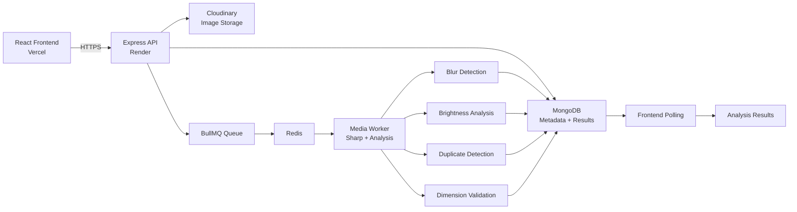

# gOGig — Intelligent Media Processing Pipeline

<div align="center">
  
  
  
  
  
  
</div>

gOGig is a production-style media processing system for vehicle images, designed to detect quality issues and duplicate content in an asynchronous workflow.

The application accepts image uploads through a REST API, stores metadata in MongoDB, uploads files to Cloudinary, queues background processing with BullMQ and Redis, analyzes the media in a worker, and exposes a status API that the frontend polls to display results.

This project was developed as part of the gOGig Backend + AI Engineering Take-Home Assignment.

> Built with React, Node.js, MongoDB, Redis, BullMQ, and Cloudinary.

> [!IMPORTANT]
> gOGig demonstrates a complete media workflow: upload → store → queue → analyze → report.

## ✨ At a Glance

| Capability | Summary |
|---|---|
| Upload flow | Validated image upload with unique processing tracking |
| Background processing | Redis-backed BullMQ queue with worker-based analysis |
| Duplicate detection | Exact and near-duplicate checks for repeated or similar images |
| Quality validation | Blur, brightness, and minimum-dimension analysis |
| Data flow | Cloudinary for storage and MongoDB for metadata + results |

## 📌 Project Snapshot

- Asynchronous image upload and processing pipeline
- Queue-driven analysis with Redis and BullMQ
- Exact and near-duplicate detection
- Blur, brightness, and dimension validation
- Cloud-based image storage with frontend polling for result reporting

---

## 🌐 Live Application

### Frontend
https://gogig-two.vercel.app

### Backend API
https://gogig.onrender.com

### GitHub Repository
https://github.com/YUVARAJ-PUGGI/Gogig

---

## 1. Overview

The core objective of gOGig is to demonstrate a reliable asynchronous media-processing pipeline.

The application performs the following operations:

1. Accept an image upload.
2. Validate the uploaded file.
3. Generate a unique processing ID.
4. Upload the image to Cloudinary.
5. Store metadata in MongoDB.
6. Add the image-processing job to a BullMQ queue.
7. Process the image asynchronously in a background worker.
8. Perform image-analysis checks.
9. Store analysis results in MongoDB.
10. Allow the frontend to poll the status endpoint and display the final analysis.

The system currently performs these checks:

- Exact duplicate detection
- Near-duplicate detection
- Blur detection
- Brightness analysis
- Image dimension validation

---

## 2. Key Features

- REST API for image uploads
- Unique processing ID for every upload
- Cloudinary image storage
- MongoDB metadata persistence
- Redis-backed BullMQ asynchronous processing
- Background worker for media analysis
- SHA-256 exact duplicate detection
- DCT-based perceptual hashing
- Hamming-distance near-duplicate detection
- Blur detection
- Brightness classification
- Image dimension validation
- Processing status API
- Frontend polling for processing results
- Job retry handling
- Invalid and corrupted file validation
- Live deployment on Vercel and Render

---

## 3. System Architecture



---

# 4. Processing Flow

## Step 1 — Upload

The frontend sends an image to:

```bash
POST /api/media
```

The backend validates the upload and sends the image to Cloudinary. Each upload receives a unique processing ID for tracking.

---

## Step 2 — Metadata Persistence

The application stores information such as:

- processingId
- originalName
- mimeType
- fileSize
- cloudinaryUrl
- status
- analysisResults
- error
- createdAt
- updatedAt

in MongoDB.

---

## Step 3 — Queue Creation

After the upload is saved, a BullMQ job is created in the:

```text
media-processing
```

queue.

The API returns immediately instead of waiting for analysis to complete.

Example response:

```json
{
  "success": true,
  "message": "Image uploaded successfully",
  "data": {
    "processingId": "62f35a0d-40b6-4279-bb9a-b1b52d94a9cd",
    "status": "pending",
    "cloudinaryUrl": "https://res.cloudinary.com/..."
  }
}
```

---

# 5. Asynchronous Processing

The project uses:

- BullMQ
- Redis
- ioredis

for asynchronous image processing.

The worker receives jobs from the queue and performs analysis independently from the upload request.

In the current deployment setup, the media worker is started from the same Node.js process as the Express server via:

```js
import "./workers/media.worker.js";
```

This keeps the API and worker working together within the available deployment environment. For a larger production architecture, the worker could be separated into a dedicated background service.

---

# 6. Processing Status

Each uploaded image has a processing status.

The flow is:

```text
pending
   ↓
processing
   ↓
completed
```

If processing fails, the error is stored and the job can be retried according to the BullMQ retry configuration.

The frontend polls the status endpoint until processing completes or fails.

---

# 7. Image Analysis

The system currently performs five major checks.

---

## 7.1 Exact Duplicate Detection

Exact duplicate detection uses a SHA-256 hash of the original image file.

Conceptually:

```text
Image File
   ↓
SHA-256
   ↓
64-character hexadecimal hash
   ↓
Compare with stored hashes
```

If the same SHA-256 hash already exists in MongoDB, the system reports:

```json
{
  "isDuplicate": true,
  "type": "exact",
  "distance": 0
}
```

This detects repeated uploads of the same file.

---

## 7.2 Near-Duplicate Detection

The application also uses a custom perceptual hashing implementation to detect visually similar images.

The perceptual hash uses a DCT-based approach:

1. Resize the image to 32 × 32 pixels.
2. Convert to grayscale.
3. Extract raw pixel values.
4. Process through a discrete cosine transform.
5. Use low-frequency coefficients.
6. Compare with the median value.
7. Generate a 64-bit perceptual hash.

The system calculates the Hamming distance between two perceptual hashes.

Current threshold:

```text
PHASH_THRESHOLD = 28
```

If the distance is within the configured threshold, the system reports a possible near duplicate.

Example:

```json
{
  "isDuplicate": true,
  "type": "near",
  "distance": 10
}
```

---

## 7.3 Blur Detection

Blur detection is implemented as a heuristic image-quality check.

The system calculates a blur score and compares it with a threshold.

Example:

```text
Blur score: 2.26
Threshold: 100
Result: Blurry
```

Another image may produce:

```text
Blur score: 4598.87
Threshold: 100
Result: Sharp
```

The system classifies the image as either:

- Blurry
- Sharp

This is a heuristic quality measure rather than a deep-learning model, so the threshold may need recalibration for different datasets.

---

## 7.4 Brightness Analysis

Brightness analysis calculates the mean brightness of the image.

Current thresholds:

```text
Dark: mean brightness < 60
Normal: 60 <= mean brightness <= 190
Bright: mean brightness > 190
```

Example:

```text
Mean brightness: 198.87
Result: Bright
```

Another example:

```text
Mean brightness: 38.47
Result: Dark
```

---

## 7.5 Dimension Validation

The system checks whether the image meets a minimum pixel requirement.

Current minimum pixel count:

```text
307,200 pixels
```

For example:

```text
461 × 815 = 375,715 pixels
```

This passes validation.

Whereas:

```text
400 × 707 = 282,800 pixels
```

does not meet the minimum requirement.

Result example:

```json
{
  "isValid": false
}
```

---

# 8. API Endpoints

## Upload Image

```bash
POST /api/media
```

The request uses multipart form data.

Field:

```text
image
```

Example:

```bash
curl -X POST https://gogig.onrender.com/api/media \
  -F "image=@path/to/image.jpg"
```

Example response:

```json
{
  "success": true,
  "message": "Image uploaded successfully",
  "data": {
    "processingId": "62f35a0d-40b6-4279-bb9a-b1b52d94a9cd",
    "status": "pending",
    "cloudinaryUrl": "https://res.cloudinary.com/..."
  }
}
```

---

## Get Processing Status

```bash
GET /api/media/:processingId
```

Example:

```bash
curl https://gogig.onrender.com/api/media/62f35a0d-40b6-4279-bb9a-b1b52d94a9cd
```

Example response:

```json
{
  "success": true,
  "data": {
    "processingId": "62f35a0d-40b6-4279-bb9a-b1b52d94a9cd",
    "originalName": "image3.jpeg",
    "mimeType": "image/jpeg",
    "fileSize": 201580,
    "cloudinaryUrl": "https://res.cloudinary.com/...",
    "status": "completed",
    "analysisResults": {
      "message": "Processing completed",
      "duplicate": {
        "isDuplicate": true,
        "type": "exact",
        "distance": 0
      },
      "blur": {
        "isBlurry": false,
        "score": 1308.65,
        "threshold": 100
      },
      "brightness": {
        "meanBrightness": 124.42,
        "level": "normal",
        "thresholds": {
          "dark": 60,
          "bright": 190
        }
      },
      "dimensions": {
        "isValid": true,
        "width": 960,
        "height": 1280,
        "pixelCount": 1228800,
        "minimumPixelCount": 307200
      }
    },
    "error": null
  }
}
```

---

## Health Check

```bash
GET /api/health
```

Example:

```bash
curl https://gogig.onrender.com/api/health
```

Example response:

```json
{
  "success": true,
  "message": "gOGig Media Processing API is running"
}
```

---

# 9. Project Structure

```text
Gogig/
│
├── backend/
│   ├── src/
│   │   ├── config/
│   │   │   ├── cloudinary.js
│   │   │   └── db.js
│   │   │
│   │   ├── controllers/
│   │   │   └── media.controller.js
│   │   │
│   │   ├── middleware/
│   │   │   └── upload.middleware.js
│   │   │
│   │   ├── models/
│   │   │   └── Media.js
│   │   │
│   │   ├── queue/
│   │   │   └── media.queue.js
│   │   │
│   │   ├── routes/
│   │   │   └── media.routes.js
│   │   │
│   │   ├── services/
│   │   │   ├── cloudinary.service.js
│   │   │   └── image-analysis/
│   │   │       ├── blur.service.js
│   │   │       ├── brightness.service.js
│   │   │       ├── create-test-images.js
│   │   │       ├── dimension.service.js
│   │   │       ├── duplicate.service.js
│   │   │       ├── duplicate-detection.service.js
│   │   │       ├── test-blur.js
│   │   │       ├── test-brightness.js
│   │   │       ├── test-dimensions.js
│   │   │       ├── test-duplicate.js
│   │   │       └── test-phash.js
│   │   │
│   │   ├── workers/
│   │   │   └── media.worker.js
│   │   │
│   │   ├── app.js
│   │   └── server.js
│   │
│   ├── package.json
│   └── .env.example
│
├── frontend/
│   ├── src/
│   │   ├── App.jsx
│   │   ├── App.css
│   │   ├── index.css
│   │   ├── main.jsx
│   │   └── assets/
│   │
│   ├── package.json
│   └── .env.example
│
├── .gitignore
├── README.md
└── package.json
```

---

## 10. Technology Stack

| Category | Stack |
|---|---|
| Frontend | React, Vite, JavaScript, CSS |
| Backend | Node.js, Express.js, ES modules, Multer |
| Image processing | Sharp, SHA-256, custom perceptual hashing |
| Database | MongoDB, Mongoose |
| Queue & workers | BullMQ, Redis, ioredis |
| Media storage | Cloudinary |
| Deployment | Vercel, Render, MongoDB Atlas, Redis |

---

# 11. Database Design

The main persistence model is the `Media` model.

It stores:

```text
processingId
originalName
mimeType
fileSize
cloudinaryUrl
status
sha256Hash
perceptualHash
analysisResults
error
createdAt
updatedAt
```

This keeps binary media in cloud storage while MongoDB stores metadata, processing state, hashes, and analysis results.

---

# 12. Failure Handling

The application validates input at multiple stages:

```text
Frontend validation
   ↓
Backend upload validation
   ↓
Cloudinary upload
   ↓
MongoDB metadata save
   ↓
BullMQ job creation
   ↓
Worker processing
   ↓
Image analysis
   ↓
Completed / Failed
```

Invalid image files are rejected before they are processed. BullMQ also provides retry support for transient failures.

---

# 13. Local Development

## Backend

```bash
cd backend
npm install
```

Create a `.env` file using `.env.example` as a guide.

Required configuration includes:

```text
PORT
MONGODB_URI
REDIS_URL
CLOUDINARY_CLOUD_NAME
CLOUDINARY_API_KEY
CLOUDINARY_API_SECRET
```

Start the backend:

```bash
npm run dev
```

---

## Worker

For a local setup where the worker runs separately:

```bash
npm run worker
```

In the current deployment setup, the worker is started by `server.js`.

---

## Frontend

```bash
cd frontend
npm install
```

Set the frontend API URL:

```text
VITE_API_URL
```

Then run:

```bash
npm run dev
```

---

# 14. Environment Variables

## Backend

Example:

```env
PORT=5000
MONGODB_URI=your_mongodb_connection_string
REDIS_URL=your_redis_connection_string
CLOUDINARY_CLOUD_NAME=your_cloudinary_cloud_name
CLOUDINARY_API_KEY=your_cloudinary_api_key
CLOUDINARY_API_SECRET=your_cloudinary_api_secret
```

## Frontend

Example:

```env
VITE_API_URL=http://localhost:5000
```

For production, the frontend points to:

```text
https://gogig.onrender.com
```

---

## 15. Assumptions & Trade-offs

## Assumptions

- Uploaded files are expected to be valid image files.
- Blur detection is treated as a heuristic image-quality measurement.
- Brightness classification is based on configured mean-brightness thresholds.
- SHA-256 is used for exact file duplicate detection.
- Perceptual hashing is used for visually similar/near-duplicate detection.
- Near-duplicate detection is heuristic and may require calibration using a larger real-world dataset.
- Image quality validation currently uses a minimum pixel-count threshold.
- Vehicle-number OCR and Indian registration-number validation were not implemented in the current version.

## Trade-offs

### Shared API and Worker Process

For the current deployment, the media worker runs in the same Node.js process as the Express API.

**Advantage:**
- Simple deployment.
- Lower infrastructure cost.
- Suitable for the assignment demonstration.

**Trade-off:**
- API and worker share CPU and memory.
- Heavy image processing could affect API responsiveness.
- A dedicated worker service would be better for production workloads.

### Heuristic Image Analysis

Custom image-processing heuristics were used instead of a large ML inference pipeline.

**Advantage:**
- Lightweight.
- Fast.
- Easy to debug.
- No additional ML infrastructure required.

**Trade-off:**
- Results are not perfect.
- Thresholds may need calibration against real-world data.
- Some edge cases may produce false positives or false negatives.

### Cloudinary Storage

Images are stored in Cloudinary while MongoDB stores metadata and analysis results.

**Advantage:**
- Keeps binary files outside the database.
- Dedicated media storage.
- Easier image delivery.

**Trade-off:**
- Adds an external service dependency.
- Production usage depends on Cloudinary limits and availability.

### Perceptual Hash Threshold

The current pHash threshold is configured as:

PHASH_THRESHOLD = 28

This provides a simple mechanism for identifying visually similar images, but the threshold would ideally be calibrated using a larger dataset.

### Scope

The assignment focuses on demonstrating an asynchronous media-processing pipeline. Therefore, advanced features such as OCR, vehicle-number validation, tamper detection, and ML-based classification were intentionally left as future improvements.

---

## 16. Future Enhancements

With more development time, the following improvements would be valuable:

- dedicated worker service for production
- horizontal scaling of workers
- OCR for vehicle number plates
- Indian vehicle registration validation
- tampering detection
- improved confidence scoring
- better duplicate/distance calibration
- automated testing
- Docker Compose setup
- CI/CD pipeline
- authentication and authorization
- rate limiting
- monitoring and observability

---

## 17. Assignment Sample Validation

The three sample images provided as part of the assignment were tested using the deployed application.

All three images successfully passed through the asynchronous processing pipeline and reached the `completed` state.

The screenshots submitted with the assignment demonstrate the frontend results for these sample images.

### Important Duplicate Detection Note

The sample images had already been uploaded during development testing.

When the same files were uploaded again during final validation, the SHA-256 based exact-duplicate detector correctly identified them as previously processed files.

This behavior is expected because the duplicate detector is designed to identify repeated uploads of the same file.

Additional independent test images were used to validate the different analysis behaviors:

| Test Image | Observed Result |
|---|---|
| Blurred image | Detected as blurry |
| Dark image | Detected as dark |
| Bright image | Detected as bright |
| Resized image | Invalid dimensions |
| Compressed image | Successfully processed |
| Same image uploaded again | Exact duplicate |
| Visually similar image | Near duplicate |
| Invalid/corrupted image | Upload rejected |

The deployed application therefore demonstrates both the required assignment flow and independent validation of the image-analysis components.

---

## 18. AI Usage & Validation

AI tools were used as development assistants during the project.

## Where AI Was Used

AI assistance was used for:

- Understanding implementation strategies.
- Debugging Node.js and Express issues.
- Troubleshooting MongoDB connectivity.
- Troubleshooting Redis and BullMQ configuration.
- Debugging deployment issues.
- Reviewing project architecture.
- Discussing API design.
- Suggesting testing approaches.
- Identifying edge cases.
- Improving documentation.

## How AI Output Was Validated

AI-generated suggestions were treated as recommendations rather than authoritative solutions.

The generated code and suggestions were validated by:

- Running the application locally.
- Testing API endpoints using cURL.
- Checking MongoDB connectivity.
- Checking Redis connectivity.
- Verifying Cloudinary uploads.
- Checking Render deployment logs.
- Testing BullMQ worker execution.
- Uploading real images through the deployed API.
- Checking processing status through the status API.
- Comparing the returned analysis results with expected behavior.

Some AI suggestions did not directly match the existing project structure or deployment environment and required modification before being used. Instead of applying suggestions blindly, the implementation was adapted to the existing codebase and verified through actual runtime testing.

For example, deployment-related Redis and worker behavior required additional debugging based on the actual Render environment. The final implementation was verified by checking Redis connectivity, worker startup logs, real image-processing jobs, and completed API responses.

This validation process helped ensure that AI-assisted code was actually working in the deployed application rather than only appearing correct in theory.

---

## 19. Conclusion

gOGig demonstrates a practical asynchronous image-processing workflow with:

- React frontend
- Express backend
- MongoDB persistence
- Cloudinary image storage
- Redis and BullMQ queue management
- background media worker
- Sharp-based image processing
- exact duplicate detection
- near-duplicate detection
- blur detection
- brightness analysis
- image dimension validation
- live deployment

The project prioritizes practical engineering decisions, modularity, asynchronous processing, and clear documentation of limitations.

The deployed application can be accessed at:

https://gogig-two.vercel.app

---
